## Electromagnetics illustrations using Ansys HFSS
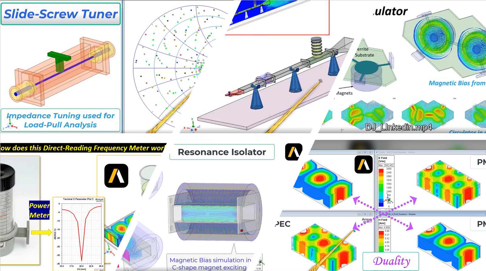

+  [Reciprocity](https://www.linkedin.com/feed/update/urn:li:activity:7090251774510452736?utm_source=share&utm_medium=member_desktop)
+  [Duality](https://www.linkedin.com/feed/update/urn:li:activity:7087301378447986688?utm_source=share&utm_medium=member_desktop)
+  [Enhanced Bounce Diagram](https://www.linkedin.com/feed/update/urn:li:activity:7088114458455113728?utm_source=share&utm_medium=member_desktop)
+  [Clarinet as a Horn Antenna](https://www.linkedin.com/feed/update/urn:li:activity:7073731131421970432?utm_source=share&utm_medium=member_desktop)
+  [Slide Screw Tuner working principle](https://www.linkedin.com/feed/update/urn:li:activity:7072264357472063488?utm_source=share&utm_medium=member_desktop)
+  [Resonance Isolator](https://www.linkedin.com/feed/update/urn:li:activity:7069214665616089088?utm_source=share&utm_medium=member_desktop)
+  [Dual Junction Circulator](https://www.linkedin.com/feed/update/urn:li:activity:7067981858117988352?utm_source=share&utm_medium=member_desktop)
+  [Microwave Testbench](https://www.linkedin.com/feed/update/urn:li:activity:7059154495213109249?utm_source=share&utm_medium=member_desktop)
+  [Direct Reading Frequency Meter](https://www.linkedin.com/feed/update/urn:li:activity:7058814767045476352?utm_source=share&utm_medium=member_desktop)
+  [Edge Guided Mode Isolator](https://www.linkedin.com/feed/update/urn:li:activity:7054486575467941888?utm_source=share&utm_medium=member_desktop)
+  [Faraday Rotation Isolator](https://www.linkedin.com/feed/update/urn:li:activity:7054131122363895808?utm_source=share&utm_medium=member_desktop)

## Writeups relevant to Signal Integrity
+ [Djorjovic-Sarkar Model as in HFSS](https://www.linkedin.com/feed/update/urn:li:activity:6957530165891477504?utm_source=share&utm_medium=member_desktop)
+ [Debye Model as in HFSS](https://www.linkedin.com/feed/update/urn:li:activity:6988146589634629632?utm_source=share&utm_medium=member_desktop)
+ [A primer on Generalized, Normalized, Power and Active S-Parameters](https://www.linkedin.com/feed/update/urn:li:activity:6928332906566225920?utm_source=share&utm_medium=member_desktop)

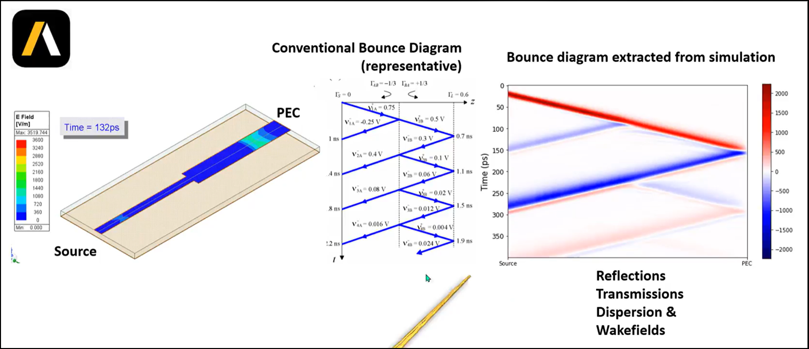
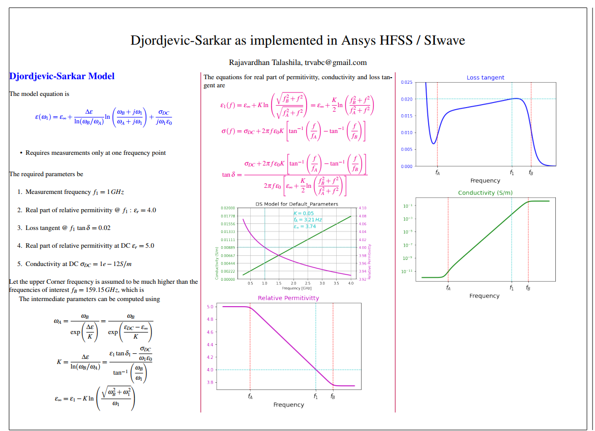
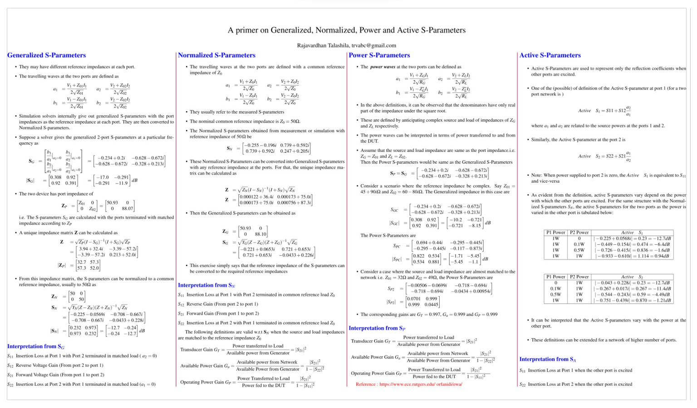

## Teaching Assistant for NPTEL (Two times)

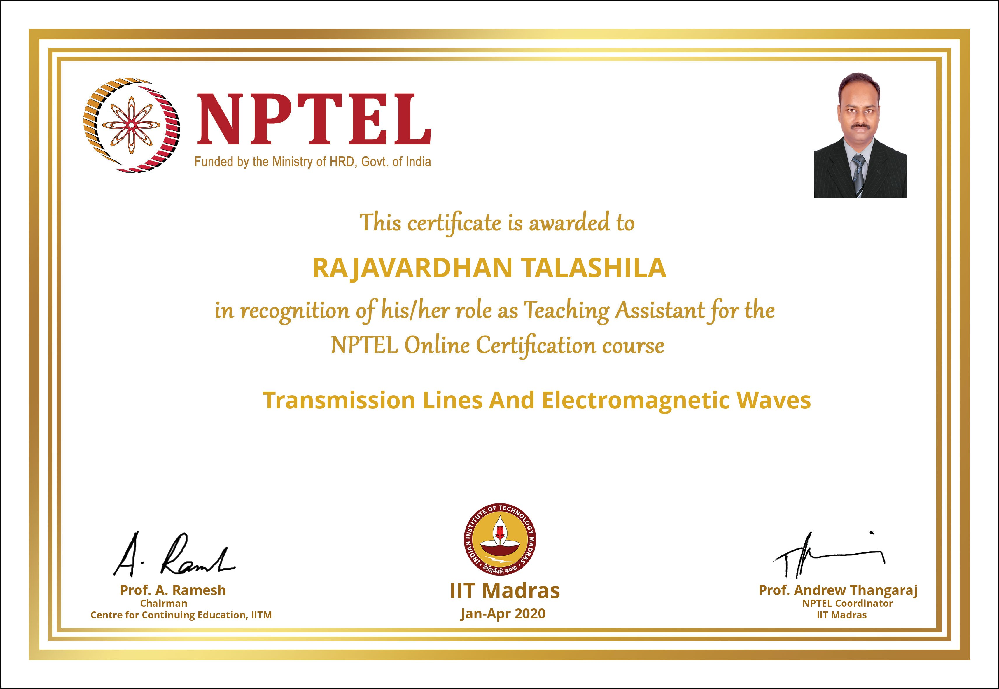

## NPTEL_Certifications
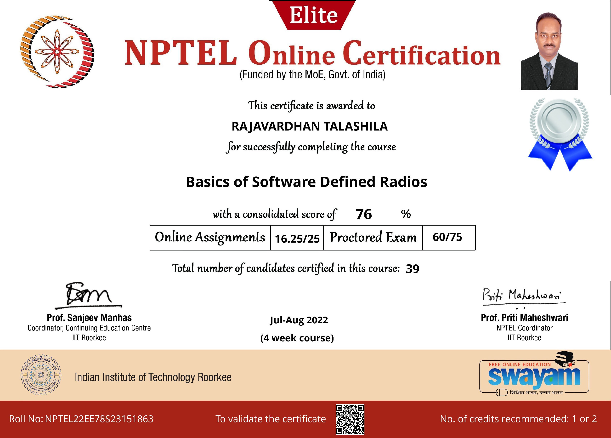

## Masters Project : IITMSAT
### Effect of Attitude on the communication aspects
* The antenna radiation patterns for the Tx and Rx on the IITMSAT are analyzed along with the attitude dynamics.
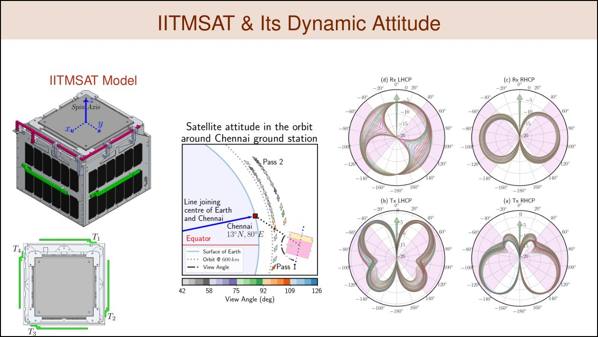
* The effect LHCP / RHCP on the overall link dynamics for a LEO satellite moving through the field of view of a ground station at Chennai are analyzed.
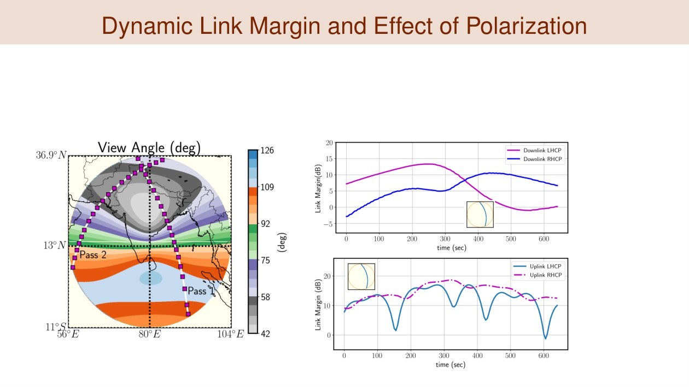

## Pyramidal Horn Antenna : Multipole Analysis
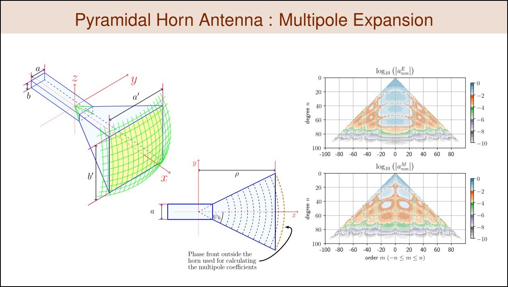
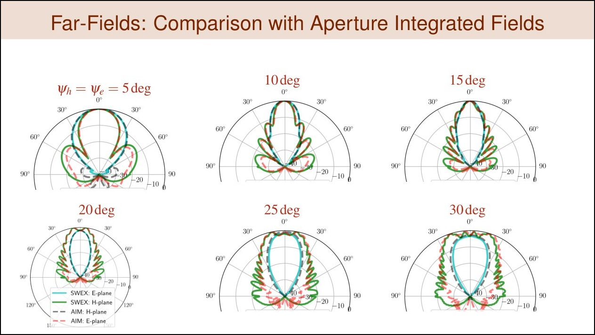
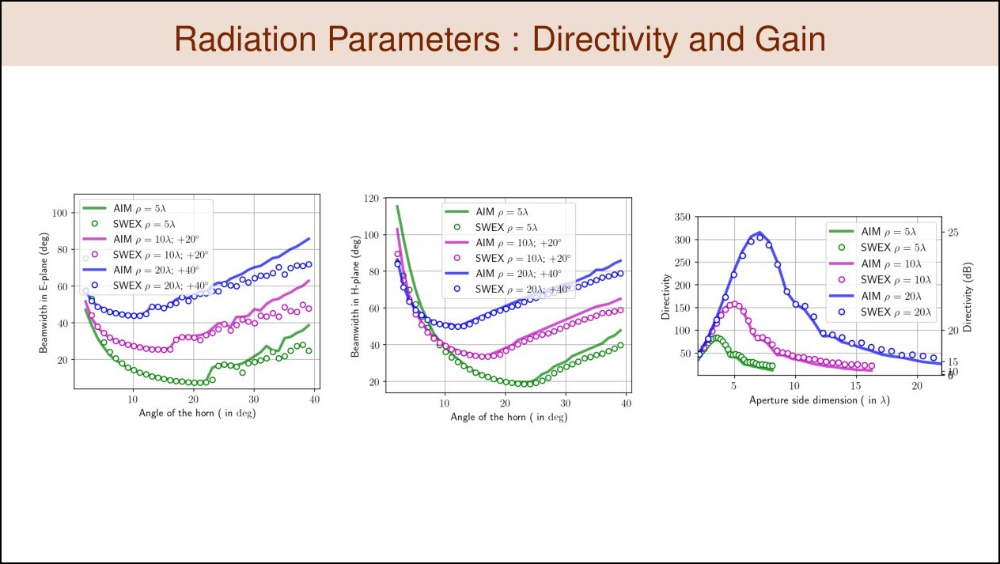
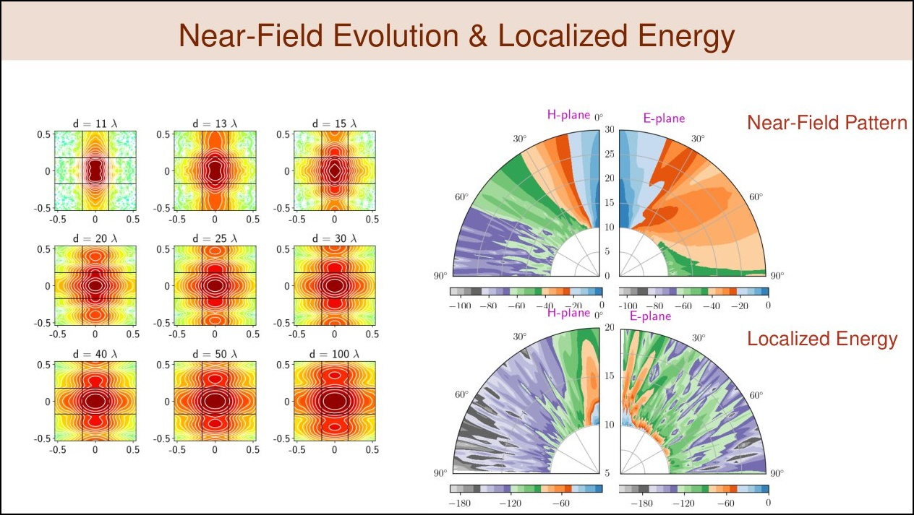
