# Rajavardhan Talashila (RT)
*[LinkedIn](https://www.linkedin.com/in/rajavardhan-talashila-rt-37800a76/)
*[Youtube : trvabc](https://www.youtube.com/@trvabc)
*[Spherical Harmonics : An introduction](https://youtu.be/3lHz0jAk6fY?si=tH91g7CLzt1tSL9G)

# Electromagnetics illustrations using Ansys HFSS

+  [Reciprocity](https://www.linkedin.com/feed/update/urn:li:activity:7090251774510452736?utm_source=share&utm_medium=member_desktop)
+  [Duality](https://www.linkedin.com/feed/update/urn:li:activity:7087301378447986688?utm_source=share&utm_medium=member_desktop)
+  [Enhanced Bounce Diagram](https://www.linkedin.com/feed/update/urn:li:activity:7088114458455113728?utm_source=share&utm_medium=member_desktop)
+  [Clarinet as a Horn Antenna](https://www.linkedin.com/feed/update/urn:li:activity:7073731131421970432?utm_source=share&utm_medium=member_desktop)
+  [Slide Screw Tuner working principle](https://www.linkedin.com/feed/update/urn:li:activity:7072264357472063488?utm_source=share&utm_medium=member_desktop)
+  [Resonance Isolator](https://www.linkedin.com/feed/update/urn:li:activity:7069214665616089088?utm_source=share&utm_medium=member_desktop)
+  [Dual Junction Circulator](https://www.linkedin.com/feed/update/urn:li:activity:7067981858117988352?utm_source=share&utm_medium=member_desktop)
+  [Microwave Testbench](https://www.linkedin.com/feed/update/urn:li:activity:7059154495213109249?utm_source=share&utm_medium=member_desktop)
+  [Direct Reading Frequency Meter](https://www.linkedin.com/feed/update/urn:li:activity:7058814767045476352?utm_source=share&utm_medium=member_desktop)
+  [Edge Guided Mode Isolator](https://www.linkedin.com/feed/update/urn:li:activity:7054486575467941888?utm_source=share&utm_medium=member_desktop)
+  [Faraday Rotation Isolator](https://www.linkedin.com/feed/update/urn:li:activity:7054131122363895808?utm_source=share&utm_medium=member_desktop)

# Digital Beamforming System Simulation (Work at Ansys)
* Full system Simulation (Bits to Bits)
* Used SystemVue + Ansys HFSS + AGI-STK
* Real RF component characteristics included
* The flight dynamics are implemented in STK and linked to SystemVue
* Installed array patterns from HFSS are included in SystemVue
* Time wise tracking of the Tx / Rx are done with bidirectional link between SystemVue and STK
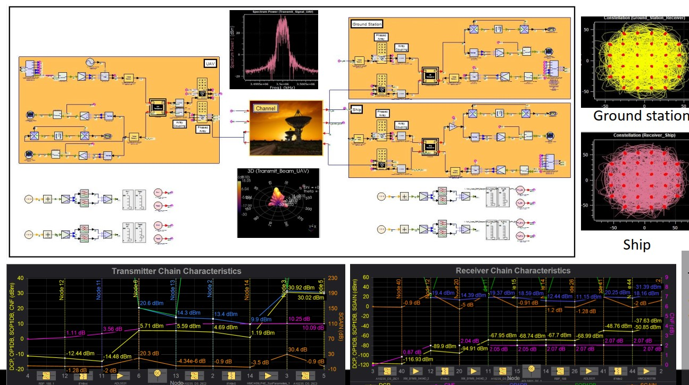
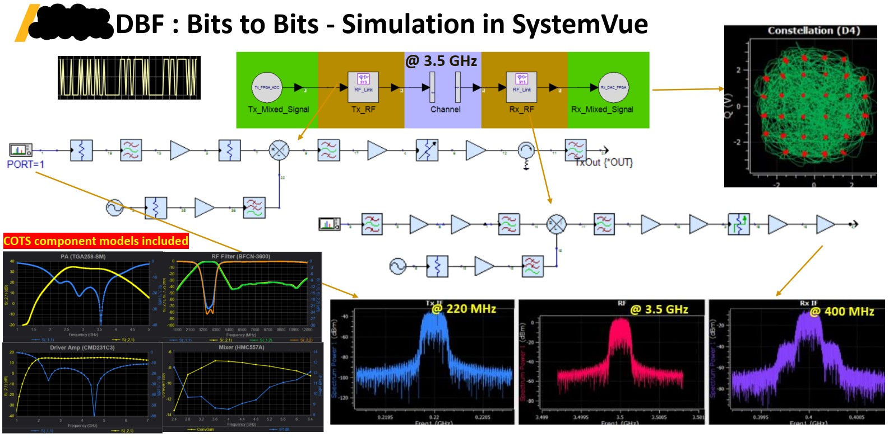

# Writeups relevant to Signal Integrity
+ [Djorjovic-Sarkar Model as in HFSS](https://www.linkedin.com/feed/update/urn:li:activity:6957530165891477504?utm_source=share&utm_medium=member_desktop)
+ [Debye Model as in HFSS](https://www.linkedin.com/feed/update/urn:li:activity:6988146589634629632?utm_source=share&utm_medium=member_desktop)
+ [A primer on Generalized, Normalized, Power and Active S-Parameters](https://www.linkedin.com/feed/update/urn:li:activity:6928332906566225920?utm_source=share&utm_medium=member_desktop)

# Bandpass Filter for 5G
* Designed, Fabricated and tested a bandpass filter with center frequency 3.5 GHz when working with the 5G Testbed at IIT Madras. 
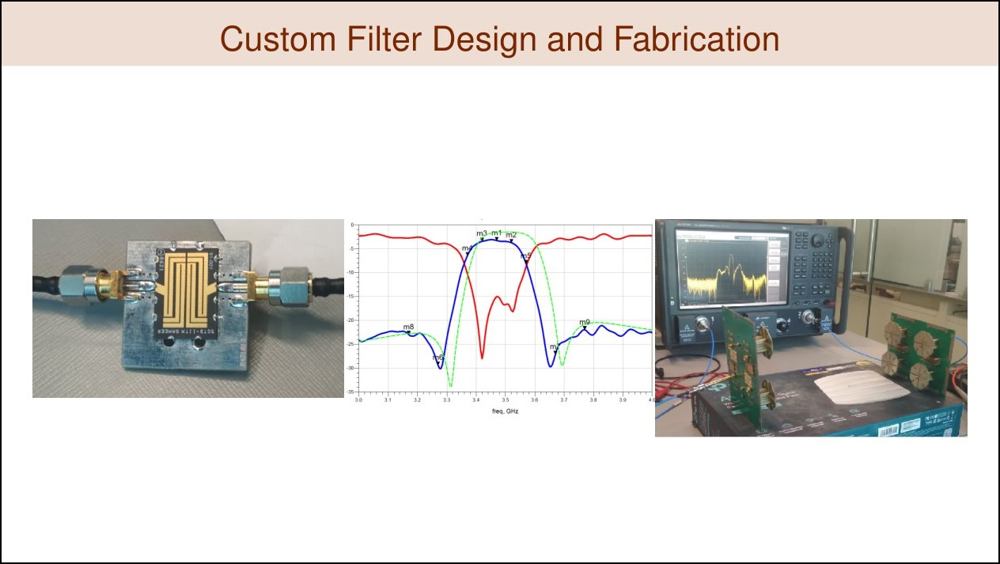

# Masters Project : IITMSAT
* Effect of Satellite Attitude on the communication aspects
* The open access journal publication is [Engineering Reports](https://onlinelibrary.wiley.com/doi/full/10.1002/eng2.12402)
* The antenna radiation patterns for the Tx and Rx on the IITMSAT are analyzed along with the attitude dynamics.

* The effect LHCP / RHCP on the overall link dynamics for a LEO satellite moving through the field of view of a ground station at Chennai are analyzed.

* The geomagnetic field directions in the relevant LEO orbit
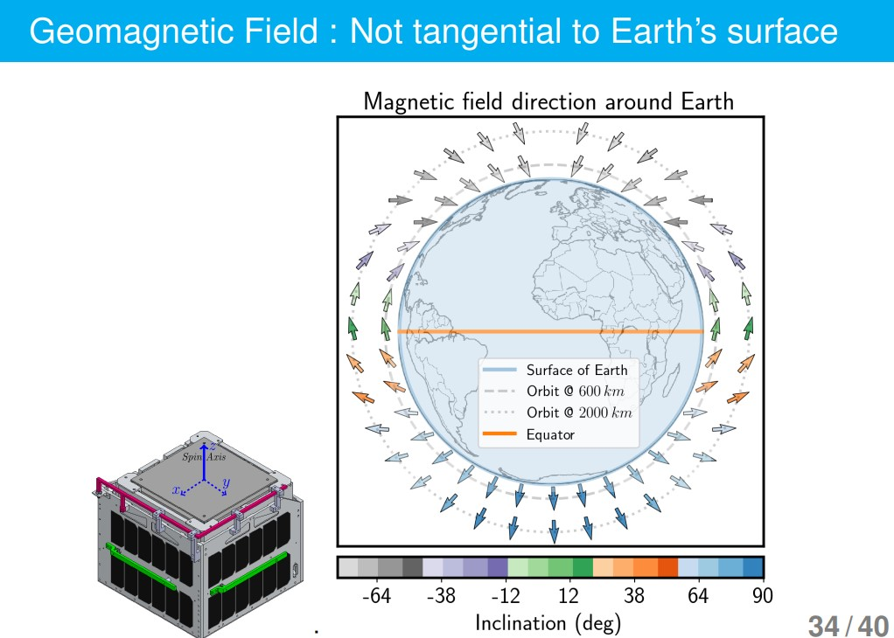

* The LEO satellite availability towards the ground station : Simulation in STK
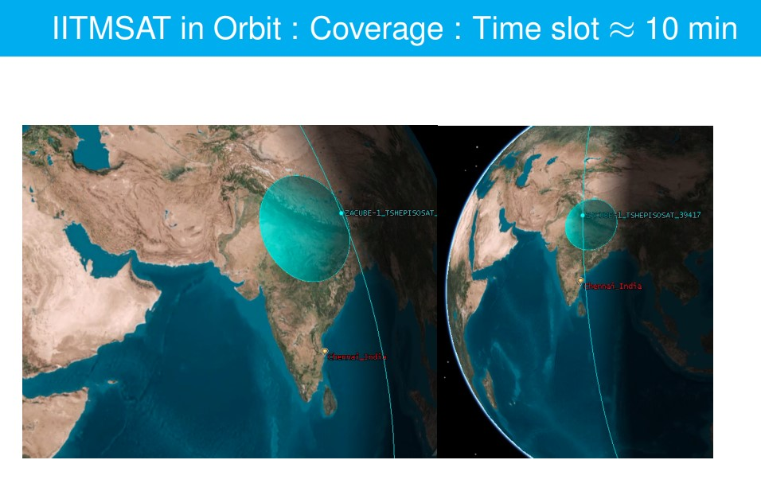

* Link Budget analysis for uplink and downlink
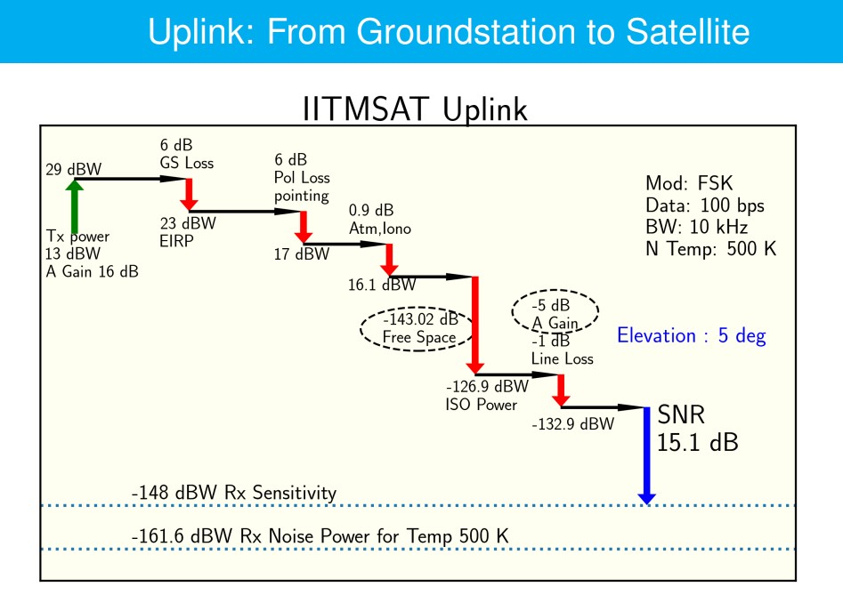
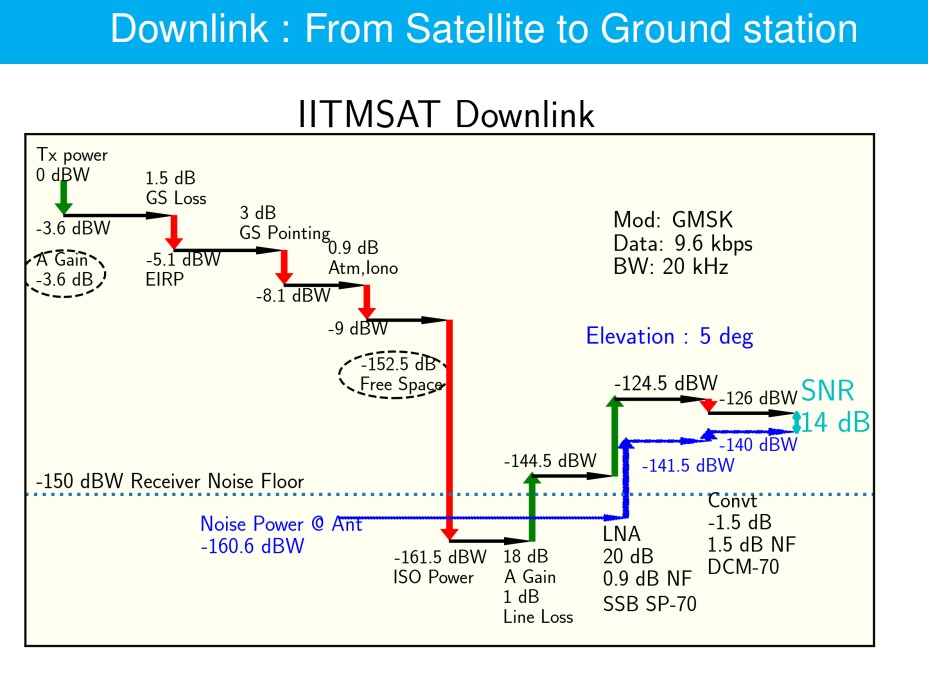

# PhD work
* Related to Multipole Expansion of EM fields
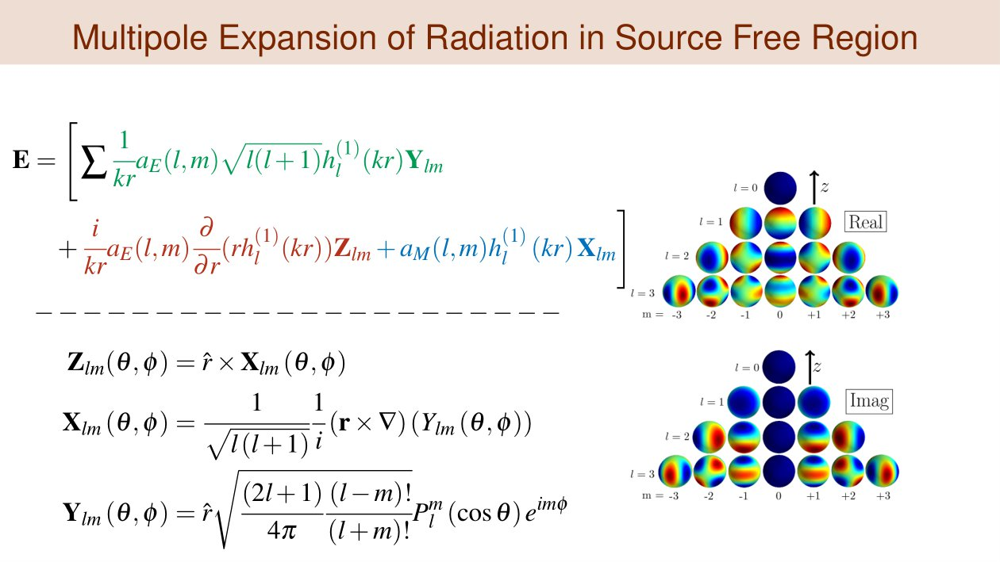

* Pyramidal Horn Antenna : Multipole Analysis

* Understanding the bandstructure of GaAs
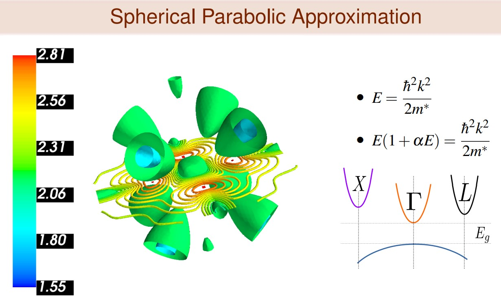
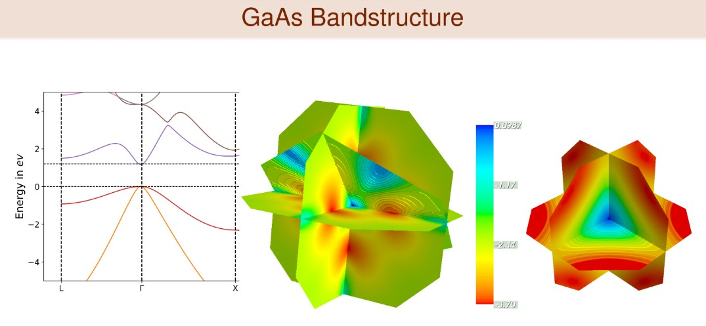

* Dynamics of Charge Carriers :  Montecarlo simulation of charge carriers in optically excited direct band-gap semiconductors
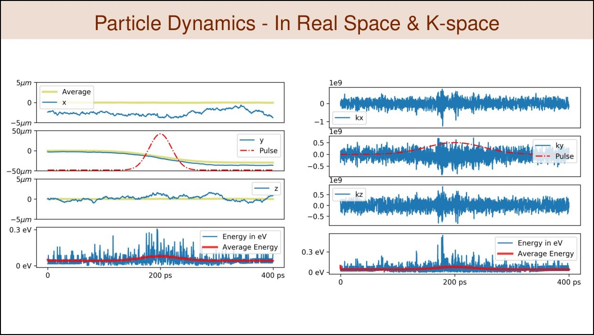
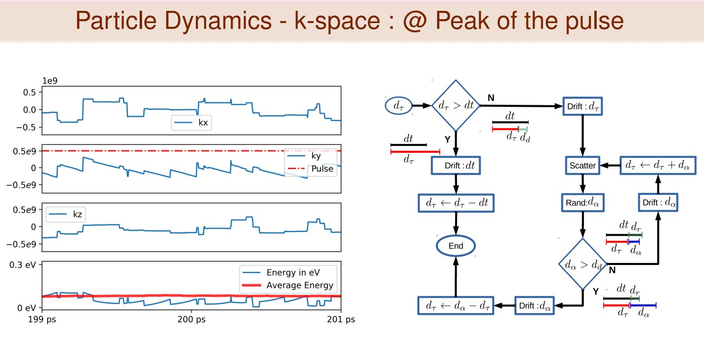

# Publications
Journal Articles

1. Talashila, R., & Ramachandran, H. (2021). Effect of polarization on the link dynamics of a spinning low-earth orbits satellite aligned with geomagnetic field. Engineering Reports
[Journal 1](https://onlinelibrary.wiley.com/doi/pdf/10.1002/eng2.12402)

2. Talashila, R., & Ramachandran, H. (2020). Multipole Expansion of Radiation From Patch Antenna Using Quasi-Static Surface Currents. IEEE Antennas and Wireless Propagation Letters, 19(12), 2136-2140. [Journal 2](https://ieeexplore.ieee.org/document/9200656/)

3. Talashila, R., & Ramachandran, H. (2019). Determination of Far Fields of Wire Antennas on a PEC Sphere Using Spherical Harmonic Expansion. IEEE Antennas and Wireless Propagation Letters, 18(4),646-650. [Journal 3](https://ieeexplore.ieee.org/document/8644039)

# NPTEL 

# Books Read

+  <b>THE DAY WE FOUND THE UNIVERSE <b> by <i>Marcia Bartusiak<i>

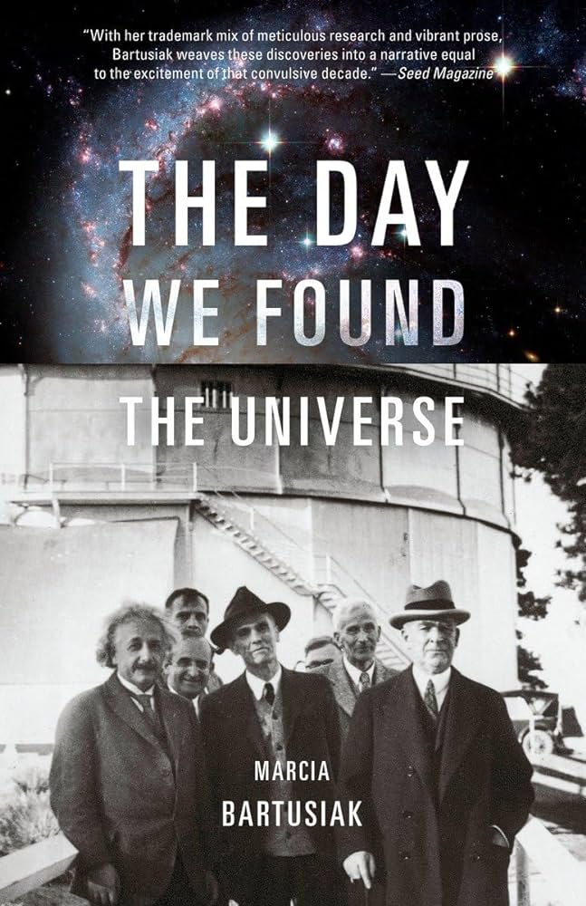

	It shows the evolution of human's understanding of the universe by studying the stars. This book is nothing less than a thriller. It takes you through the twists and turns of the conclusions made at crucial steps and their over turns. The complex human interactions are  protrayed to a good detail. You will know why the "Hubble Telescope" is named after him.

+  <b>BLACK HOLE <b> by <i>Marcia Bartusiak<i>

	It starts from the Newton's times and then takes you to the brink of the evidence leading to the possibility of the "holy grail" of physics at the event horizon of a black hole. It is intersting to note the image on the cover corresponds to the validation of the Einstein's General Theory of Relativity. 

+  <b> Einstein : A LIFE IN SCIENCE <b> by <i>Michael White and John Gribbin<i>

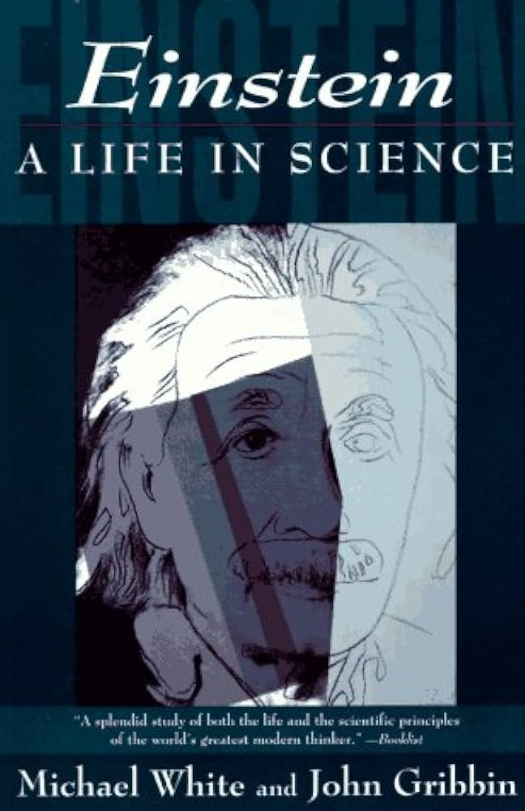

	This shows why Einstein's name props in every discussion related to phyiscs. It takes you through a good journey of his life. Along the way, the scientific details are satifying and instills a sense of appreciation towards intellectual achievements themselves.

+ <b> Michael Faraday and The Royal Institution: The Genius of Man and Place   <b> by <i> John M. Thomas   <i>

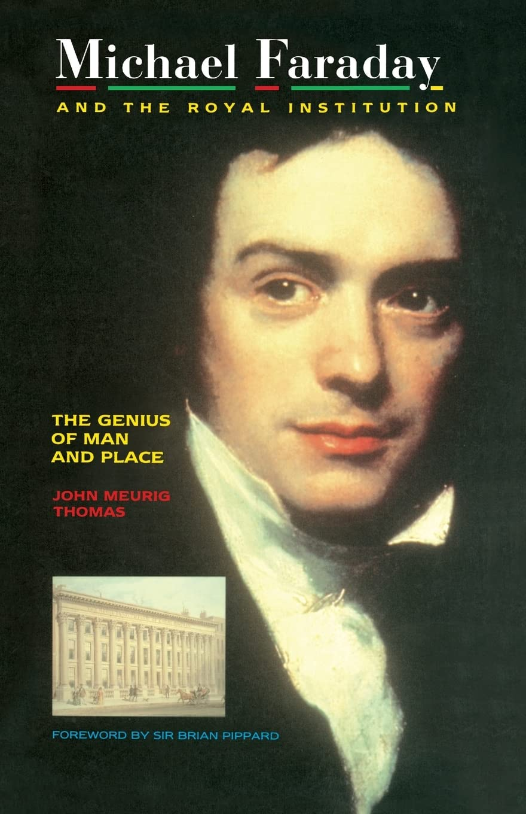

	I read this book on Prof [Andrew Zangwill's recommendation](https://shepherd.com/best-books/biographies-of-physicists).

Its a gem.

+  <b> Longitude <b> by  <i>Dava Sobel<i>

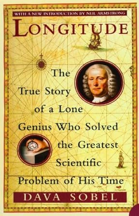

	One will understand how many obstacles one should overcome to achieve something in the scientific world. This problem was know to Newton too. But he didn't propose a solution in his lifetime.

+  <b> The Monk who sold his Ferrari <b>

	I read this book multiple times. Though I am unable to put into practice all of its contents, this book changed my life to some extent.

+  <b> THE STREET LAWYER <b> by <i>John Grisham<i>

	Depending on your personality, you will have a clear conclusion on what is important to you : Money or Social Service. This book in layers depicts the life of home less people and a lawyer who fights for them in a particular situation. By the end, you should be amazed by the balance John Grisham strikes.

+  <b> THE TESTAMENT <b> by <i>John Grisham<i>

	Money, Money, Money.  You just read it until the end for an unforgettable, sweet and  memorable experience in your life.

