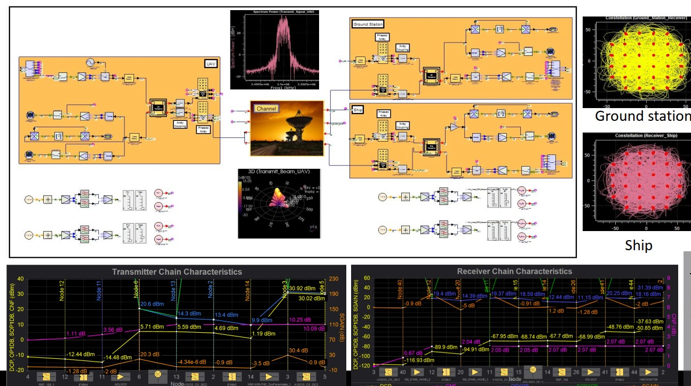
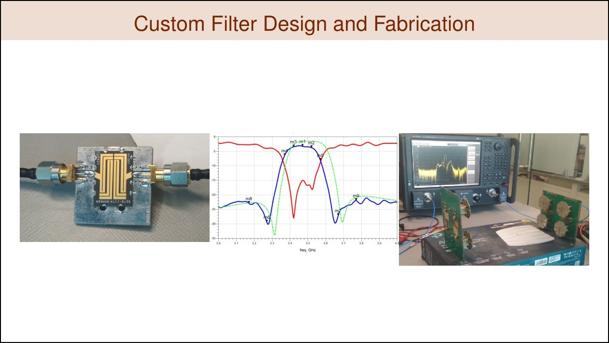
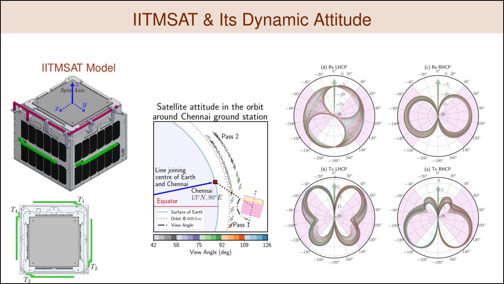
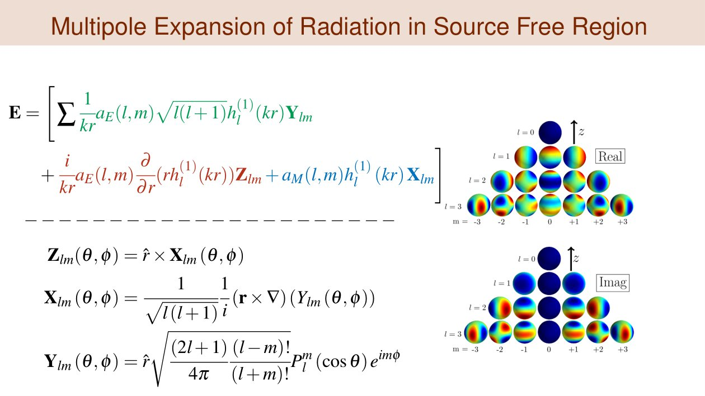

# Rajavardhan Talashila (RT)

**RF & Microwave Engineer | Quantum / Rydberg RF Sensing | Antennas & Electromagnetics | Wireless Systems**

I am an electrical engineer and researcher working at the intersection of **RF and microwave engineering, antennas, wireless systems, electromagnetic simulation, and quantum-enabled RF sensing**.

My current work at **NIST** focuses on Rydberg-atom-based RF sensing, including **angle-of-arrival estimation** and characterization of atomic RF sensors across VHF/UHF and microwave frequencies. Previously, as a **Senior Application Engineer at Ansys**, I worked on antenna, PCB, EMI/EMC, signal-integrity, power-integrity, sensing, radiation, and beamforming simulation problems.

I enjoy solving technically challenging problems that connect **fundamental physics with practical RF, wireless, sensing, and measurement systems**.

[LinkedIn](https://www.linkedin.com/in/rajavardhan-talashila-rt-37800a76/) · [Publications](#selected-publications) · [Projects](#selected-projects) · [Books I’ve Read](books/) · [YouTube](https://www.youtube.com/@trvabc) · [Email](mailto:trvabc@gmail.com)

---

## Current Research Focus

### Quantum / Rydberg RF Sensing — NIST

- Developing and experimentally studying **Rydberg-atom-based RF sensors**.
- Introduced a novel approach for **RF angle-of-arrival estimation** using subwavelength, amplitude-only measurements of standing waves.
- Characterizing Rydberg-sensor response and sensitivity across **VHF, UHF, and microwave frequencies**.
- Studying RF-induced dressed-state behavior, AC Stark shifts, and related atom-based RF measurement techniques.
- Named inventor on patent-related work arising from Rydberg RF sensing research.

**Selected publication:**  
[Determining angle of arrival of radio-frequency fields using subwavelength, amplitude-only measurements of standing waves in a Rydberg atom sensor](https://doi.org/10.1063/5.0285778) — *Journal of Applied Physics*, 2025.

---

## Professional Experience

### Project Associate — National Institute of Standards and Technology (NIST)
**Boulder, Colorado | 2024–Present**

Research in atom-based RF sensing with an emphasis on Rydberg electrometry, direction finding, RF-field characterization, optical spectroscopy, and experimental automation.

### Senior Application Engineer — Ansys
**Bengaluru, India | 2021–2023**

- Supported engineering teams across industries with **HFSS and electromagnetic simulation** problems.
- Worked on **antennas, PCB structures, sensing devices, EMI/EMC, signal integrity, power integrity, and radiation**.
- Contributed to a digital beamforming-array simulation effort associated with **AFRL**.
- Worked across full-system RF workflows involving electromagnetic models, installed antenna patterns, realistic component characteristics, and system-level simulation.

### Project Assistant — 5G Testbed, IIT Madras
**Chennai, India | 2020–2021**

- Designed, fabricated, and experimentally tested a **3.5 GHz passive bandpass filter** for 5G applications.
- Contributed to antenna design and testing for 5G base-station applications.

### Junior Telecom Officer — BSNL
**India | 2010–2012**

Worked with wired telephony, 2G/3G cellular systems, optical-fiber networks, and customer-facing telecom operations.

---

## Selected Projects

### Digital Beamforming System Simulation — Ansys

End-to-end RF system simulation combining **Ansys HFSS, Keysight PathWave SystemVue, and AGI/STK**.

- Included realistic RF component characteristics.
- Imported installed antenna-array patterns from HFSS into system-level simulation.
- Linked platform/flight dynamics in STK with communication-system simulation.
- Evaluated time-varying Tx/Rx behavior in a bidirectionally coupled workflow.

### 5G Bandpass Filter — IIT Madras

Designed, fabricated, and tested a **3.5 GHz bandpass filter** for the IIT Madras 5G Testbed.

### Satellite Communication & Antenna Analysis — IITMSAT

Studied the effect of satellite attitude and antenna polarization on LEO communication links, including:

- Tx/Rx antenna radiation patterns and spacecraft attitude dynamics.
- LHCP/RHCP behavior through a ground-station field of view.
- Orbit-dependent availability and link-budget analysis.
- STK-based orbital and communication simulations.

[Related open-access publication](https://onlinelibrary.wiley.com/doi/full/10.1002/eng2.12402)

### Multipole Expansion of Electromagnetic Radiation

Doctoral research on multipole / spherical-harmonic representations of antenna radiation, including wire, patch, and horn antennas.

---

## Electromagnetics & RF Technical Notes

I have also created short technical illustrations and write-ups on electromagnetic and microwave concepts using HFSS and related tools.

### Electromagnetics
- [Reciprocity](https://www.linkedin.com/feed/update/urn:li:activity:7090251774510452736)
- [Duality](https://www.linkedin.com/feed/update/urn:li:activity:7087301378447986688)
- [Enhanced Bounce Diagram](https://www.linkedin.com/feed/update/urn:li:activity:7088114458455113728)
- [Clarinet as a Horn Antenna](https://www.linkedin.com/feed/update/urn:li:activity:7073731131421970432)
- [Slide Screw Tuner — working principle](https://www.linkedin.com/feed/update/urn:li:activity:7072264357472063488)
- [Resonance Isolator](https://www.linkedin.com/feed/update/urn:li:activity:7069214665616089088)
- [Dual Junction Circulator](https://www.linkedin.com/feed/update/urn:li:activity:7067981858117952)
- [Microwave Testbench](https://www.linkedin.com/feed/update/urn:li:activity:7059154495213109249)
- [Direct Reading Frequency Meter](https://www.linkedin.com/feed/update/urn:li:activity:7058814767045476352)
- [Edge Guided Mode Isolator](https://www.linkedin.com/feed/update/urn:li:activity:7054486575467941888)
- [Faraday Rotation Isolator](https://www.linkedin.com/feed/update/urn:li:activity:7054131122363895808)

### Signal Integrity
- [Djordjevic–Sarkar material model in HFSS](https://www.linkedin.com/feed/update/urn:li:activity:6957530165891477504)
- [Debye model in HFSS](https://www.linkedin.com/feed/update/urn:li:activity:6988146589634629632)
- [Generalized, normalized, power, and active S-parameters](https://www.linkedin.com/feed/update/urn:li:activity:6928332906566225920)

---

## Selected Publications

1. **Talashila, R.**, Watterson, W. J., Moser, B. L., et al. (2025). “Determining Angle of Arrival of Radio-Frequency Fields Using Subwavelength, Amplitude-Only Measurements of Standing Waves in a Rydberg Atom Sensor.” *Journal of Applied Physics*, 138(11), 114402.  
   [DOI](https://doi.org/10.1063/5.0285778)

2. **Talashila, R.**, & Ramachandran, H. (2021). “Effect of polarization on the link dynamics of a spinning low-earth orbit satellite aligned with geomagnetic field.” *Engineering Reports*.  
   [Open access](https://onlinelibrary.wiley.com/doi/full/10.1002/eng2.12402)

3. **Talashila, R.**, & Ramachandran, H. (2020). “Multipole Expansion of Radiation From Patch Antenna Using Quasi-Static Surface Currents.” *IEEE Antennas and Wireless Propagation Letters*, 19(12), 2136–2140.  
   [IEEE Xplore](https://ieeexplore.ieee.org/document/9200656/)

4. **Talashila, R.**, & Ramachandran, H. (2019). “Determination of Far Fields of Wire Antennas on a PEC Sphere Using Spherical Harmonic Expansion.” *IEEE Antennas and Wireless Propagation Letters*, 18(4), 646–650.  
   [IEEE Xplore](https://ieeexplore.ieee.org/document/8644039)

---

## Technical Skills

**RF / Electromagnetics:** Antennas, RF & microwave engineering, EMI/EMC, signal integrity, power integrity, wireless systems, RF measurements, electromagnetic modeling  

**Quantum / Atomic RF Sensing:** Rydberg atoms, EIT spectroscopy, RF electrometry, AC Stark effects, atom-based field sensing  

**Simulation & Engineering Software:** Ansys HFSS, Ansys SIwave, CST Microwave Studio, Keysight PathWave SystemVue, AGI/STK, LabVIEW  

**Instrumentation:** Vector network analyzers, spectrum analyzers, oscilloscopes, signal generators, LCR meters, semiconductor lasers  

**Programming:** Python, MATLAB, Fortran, CUDA Fortran

---

## Education

- **Ph.D., Electrical Engineering — Quantum Sensing**, University of Colorado Boulder — expected 2026
- **M.S., Electrical Engineering**, University of Colorado Boulder — 2025
- **Ph.D., Electrical Engineering — RF & Microwave**, IIT Madras — 2021
- **M.Tech., Electrical Engineering — Photonics**, IIT Madras — 2021
- **B.Tech., Electronics & Communication Engineering**, JNTU Hyderabad — 2009

---

## Beyond Research

I enjoy reading about physics, science, history, philosophy, and literature. I keep a separate reading page with brief notes and reflections.

[**Books I’ve Read →**](books/)

---

## Contact

I am interested in opportunities involving **RF and microwave engineering, antennas, wireless systems, electromagnetic simulation, quantum sensing, advanced RF measurements, and research-driven hardware development**.

[LinkedIn](https://www.linkedin.com/in/rajavardhan-talashila-rt-37800a76/) · [Email](mailto:trvabc@gmail.com)
